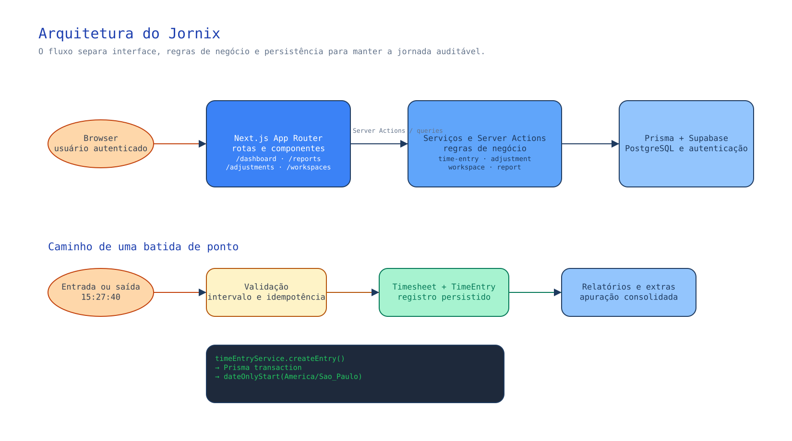

# Jornix Timesheet SaaS

Jornix é uma aplicação web para registro de ponto, cálculo de jornada e
acompanhamento de horas trabalhadas. O produto usa o horário civil de
`America/Sao_Paulo` para registrar e exibir os pontos.

## Estado atual

### Funcionalidades disponíveis

- Cadastro e login com Supabase Auth.
- Dashboard com jornada do dia, semana e mês.
- Registro alternado de entrada e saída, preservando entradas abertas após meia-noite.
- Proteção contra registros duplicados em cliques repetidos e requisições concorrentes.
- Lista dos registros do dia.
- Cálculo de horas normais e horas extras de 75% e 100%.
- Em dias úteis, as primeiras 2h extras são 75% e o excedente é 100%; fins de
  semana e feriados são apurados integralmente como 100%.
- Relatórios por intervalo com resumo e detalhamento diário.
- Relatórios por pessoa e equipe, com filtros por dia e exportação CSV compatível
  com Excel, incluindo o tempo e a quantidade de acionamentos registrados.
- Diário de atividades separado por data, com vários registros no mesmo dia,
  descrição de incidente e intervalo de horário opcional; os registros entram
  no dashboard, nos relatórios e nas exportações.
- Registro de ausências com períodos futuros, prevenção de sobreposição, aprovação
  por responsável, notificações da decisão e consolidação dos dias aprovados nos
  relatórios.
- Configuração de jornada, carga semanal e dados salariais.
- Calendário de sobreaviso com regra padrão de 15h em dias úteis e 24h em fins de
  semana/feriados, incluindo exceção manual de feriado.
- Estimativa privada de remuneração com horas extras, sobreaviso e DSR, sempre
  identificada como prévia enquanto houver pendências.
- Tema claro e escuro.
- Layout responsivo com navegação lateral no desktop e inferior no mobile.
- Espaços pessoais e empresas independentes na mesma conta, com seleção de
  espaço e permissões por vínculo.
- Convites por email, solicitação por código da empresa e definição do gestor
  pelo responsável da empresa.
- Ajustes de ponto por movimento, com motivo obrigatório, histórico imutável,
  confirmação individual ou em lote e opção de ajuste provisório por
  esquecimento.
- Fechamento mensal por pessoa e espaço, reabertura justificada e histórico de
  auditoria.
- Recuperação de senha por e-mail com callback PKCE do Supabase e troca de senha
  em sessão de recuperação.

### Pendências conhecidas

- Períodos parciais, virada de dia e recorrência de escalas ainda serão tratados
  em uma entrega futura.
- A fórmula do DSR precisa passar por validação contábil e parametrização legal
  antes de ser usada como folha oficial.
- Exportação PDF e envio por email ainda não fazem parte do primeiro formato de
  exportação (CSV/Excel compatível).
- O XLSX nativo, envio de relatórios por e-mail, férias recorrentes e períodos
  parciais de sobreaviso continuam no roadmap.
- Anexos de comprovantes de ausência e o efeito de cada tipo de ausência na
  estimativa de remuneração ainda precisam de uma regra contábil validada antes
  de alterar os valores calculados.
- O workflow de CI está preparado em `.github/workflows/ci.yml` e a conexão
  GitHub → Vercel está confirmada. Falta enviar o workflow e validar a primeira
  execução da CI e o primeiro deploy automático.

As pendências visuais e de produto estão detalhadas em
[`docs/UI-PENDING.md`](docs/UI-PENDING.md).

## Stack

- Next.js 16 com App Router e React 19.
- TypeScript.
- Tailwind CSS e componentes baseados em shadcn/ui.
- Prisma 7 com PostgreSQL.
- Supabase Auth.
- Dados da aplicação acessados no servidor pelo Prisma, com RLS e grants
  públicos revogados nas tabelas do schema `public`.
- Luxon para datas, horários e fuso.
- Node.js Test Runner para testes unitários determinísticos.

## Rotas principais

| Rota            | Descrição                                           |
| --------------- | --------------------------------------------------- |
| `/login`        | Entrada na aplicação                                |
| `/register`     | Criação de conta                                    |
| `/dashboard`    | Resumo da jornada e registros recentes              |
| `/profile`      | Perfil próprio e resumo de sobreaviso               |
| `/time-entries` | Consulta e registro de ponto                        |
| `/reports`      | Relatórios consolidados por período                 |
| `/settings`     | Jornada, carga horária e salário                    |
| `/on-call`      | Calendário de disponibilidade de sobreaviso         |
| `/absences`     | Registro e revisão de ausências                     |
| `/compensation` | Estimativa privada de remuneração do período        |
| `/workspaces`   | Espaços, equipe, convites e permissões              |
| `/adjustments`  | Ajustes de movimentos, decisões e fechamento mensal |

## Organização do código

```text
src/
├─ app/                 # Rotas, páginas e server actions
├─ components/
│  ├─ shared/           # Navegação, dashboard e componentes compartilhados
│  └─ ui/               # Primitivos visuais reutilizáveis
├─ lib/                 # Autenticação, datas, formatação e utilitários
├─ schemas/             # Validações de entrada com Zod
└─ services/            # Regras de negócio e acesso aos dados

prisma/schema.prisma    # Modelo PostgreSQL
tests/                  # Testes unitários
docs/                   # Documentação complementar
```

O dashboard separa a resolução dos parâmetros, o carregamento paralelo dos
dados e a construção do modelo visual em
`src/app/(authenticated)/dashboard/_lib/`.

Cada conta recebe um espaço pessoal durante a migração. Os registros existentes
continuam nesse espaço e não são copiados para uma empresa. Um usuário pode
participar de várias empresas, mas os serviços autenticados validam o
`workspaceId` e o vínculo ativo antes de ler ou alterar uma jornada. Salário e
jornada continuam pessoais e não são expostos a gestores.

Os movimentos originais são somente de leitura depois de gravados. Uma correção
é uma solicitação separada, que pode alterar o horário efetivo após aprovação,
sem apagar o histórico. A mesma projeção efetiva é usada no relógio, nos
relatórios e no cálculo de horas extras. A migração
`20260916190000_workspaces_adjustments_closures` faz o preenchimento inicial;
valide o banco antes de aplicá-la em produção.

## Arquitetura em uma visão

O fluxo principal separa interface, regras de negócio e persistência. O
browser usa o Supabase para autenticação; os dados da aplicação passam pelas
Server Actions, serviços e Prisma no servidor.



Veja a [arquitetura editável](docs/diagrams/architecture.excalidraw) e a
[fronteira de segurança do Data API](docs/diagrams/data-api-rls.svg) para os
detalhes técnicos.

## Configuração local

### Requisitos

- Node.js 24.x (aplicação e testes).
- pnpm 11.8.0, fixado no `package.json`.
- Projeto Supabase com PostgreSQL disponível.

### Instalação

```bash
pnpm install --frozen-lockfile
```

Copie `.env.example` para `.env` e preencha:

```env
DATABASE_URL=postgresql://...
DIRECT_URL=postgresql://...
NEXT_PUBLIC_SUPABASE_URL=https://...
NEXT_PUBLIC_SUPABASE_ANON_KEY=...
NEXT_PUBLIC_SITE_URL=http://localhost:3000
```

`DATABASE_URL` é usada pelas consultas normais através do pooler. `DIRECT_URL`
é usada pelo Prisma nas migrações e precisa estar definida ao carregar sua
configuração durante a geração do cliente no build.

### Banco de dados

```bash
pnpm prisma generate
pnpm prisma migrate dev
```

O cliente Prisma é gerado em `generated/prisma`.

Depois de revisar o SQL da migração e fazer o backup do ambiente, a aplicação
em um banco já existente usa `pnpm prisma migrate deploy`. O build não aplica
migrações automaticamente.

### Segurança de dados

O Supabase é usado no browser para autenticação. As consultas de usuários,
espaços, jornadas, ajustes e fechamentos passam pelas Server Actions e pelos
serviços do Next.js, usando Prisma no servidor. A aplicação não usa a chave
`service_role` no cliente e não consulta os dados de negócio diretamente pelo
endpoint REST `/rest/v1`.

As migrações `20260918090000_lock_down_supabase_data_api` e
`20260918110000_lock_down_prisma_migrations_rls` ativam RLS e removem os grants
de `anon` e `authenticated` das 17 tabelas protegidas, incluindo a tabela
interna `_prisma_migrations`. O acesso do Prisma pelo servidor continua
funcionando.

Para conferir o banco remoto, use a conexão `DIRECT_URL`:

```bash
node scripts/verify-rls.mjs
```

O resultado esperado informa `rls_enabled: true` e
`anon_can_select: false`/`authenticated_can_select: false` para cada tabela.
No Windows, o teste público que confirma a resposta `401` está em
[`scripts/test-rls.ps1`](scripts/test-rls.ps1). Nunca execute esse teste com a
chave `service_role`, pois ela ignora as proteções de RLS.

### Desenvolvimento

```bash
pnpm dev
```

A aplicação fica disponível em <http://localhost:3000>.

## Scripts

```bash
pnpm dev       # servidor de desenvolvimento
pnpm build     # gera o cliente Prisma e cria o build de produção
pnpm start     # inicia o build de produção
pnpm lint      # ESLint
pnpm format    # formata código e documentação com Prettier
pnpm format:check # verifica formatação sem alterar arquivos
pnpm test      # testes unitários
pnpm seed:on-call-demo # cria colaboradores e escalas de demonstração
```

O seed de demonstração localiza o usuário `Michel Telo` no espaço empresarial,
cria ou atualiza dez colaboradores com nomes pessoais de teste e marca uma
escala variada no mês atual. Ele pode ser executado novamente sem duplicar
usuários, vínculos ou dias de sobreaviso.

Os testes unitários cobrem cálculo de jornada, horas extras, datas brasileiras,
formatação, validação de relatórios e autenticação. O detalhamento está em
[`docs/TESTING.md`](docs/TESTING.md).

## Datas e fuso horário

O fuso funcional do produto é definido em `src/lib/constants.ts` como
`America/Sao_Paulo`. Entradas, saídas, relógio ao vivo e definição de “hoje”
usam esse fuso.

As colunas SQL do tipo `DATE` são normalizadas internamente para UTC apenas no
momento da persistência e da consulta. Isso evita que o horário do servidor
exclua o primeiro dia de um relatório; não altera o horário exibido ao usuário.

Uma entrada sem saída continua aberta no dia seguinte. A saída usa o horário
atual e fecha a jornada da entrada original; não é retroativa. O histórico
“Registros de hoje” considera o instante do movimento, enquanto a apuração
permanece na data da jornada. A interface avisa quando a entrada é de outro dia.

## Deploy na Vercel

O preparo, as quatro variáveis necessárias e a validação após a publicação
estão em [`docs/DEPLOYMENT.md`](docs/DEPLOYMENT.md). O build gera o cliente
Prisma, mas não aplica migrações automaticamente.

## Documentação complementar

- [`docs/ARCHITECTURE.md`](docs/ARCHITECTURE.md): responsabilidades das camadas
  e fluxo dos principais dados.
- [`docs/TESTING.md`](docs/TESTING.md): estratégia, comandos e cobertura atual.
- [`docs/SECURITY-VALIDATION.md`](docs/SECURITY-VALIDATION.md): validação dos
  avisos do Next.js e da proteção RLS do Supabase.
- [`docs/UI-PENDING.md`](docs/UI-PENDING.md): pendências de produto e interface.
- [`docs/WORKSPACES-AND-ADJUSTMENTS.md`](docs/WORKSPACES-AND-ADJUSTMENTS.md):
  regras de espaços, ajustes, permissões e fechamento.
- [`docs/diagrams/README.md`](docs/diagrams/README.md): diagramas editáveis dos
  fluxos de arquitetura, ponto, ajustes e fronteira do Data API.

## Próximos passos

- Implementar períodos parciais, virada de dia e modelos recorrentes de escala.
- Adicionar notificações persistidas.
- Validar a regra do DSR com a contabilidade antes de transformar a estimativa em
  cálculo oficial.
- Evoluir exportações para PDF e envio por email.
- Criar testes de componentes e fluxos E2E.
- Configurar CI/CD com lint, TypeScript, testes e build.
- Evoluir permissões para os perfis administrador, gestor e colaborador.
